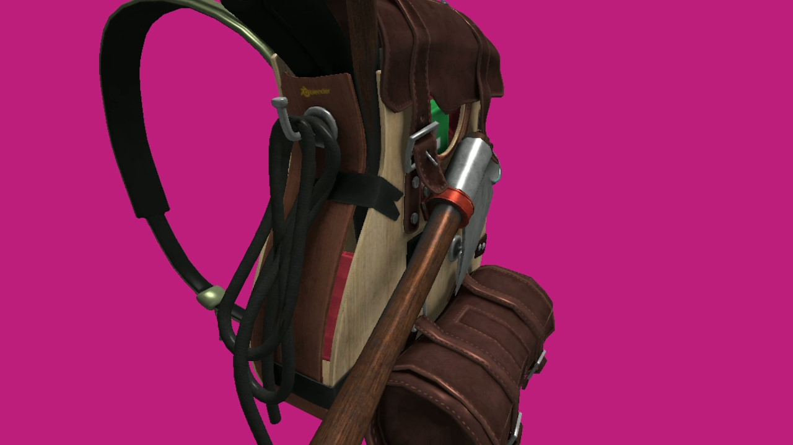
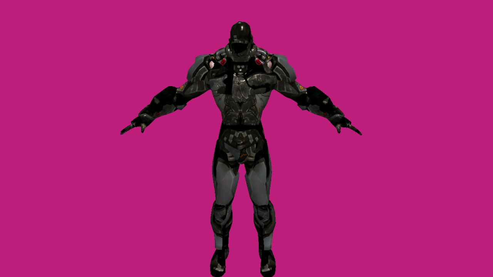
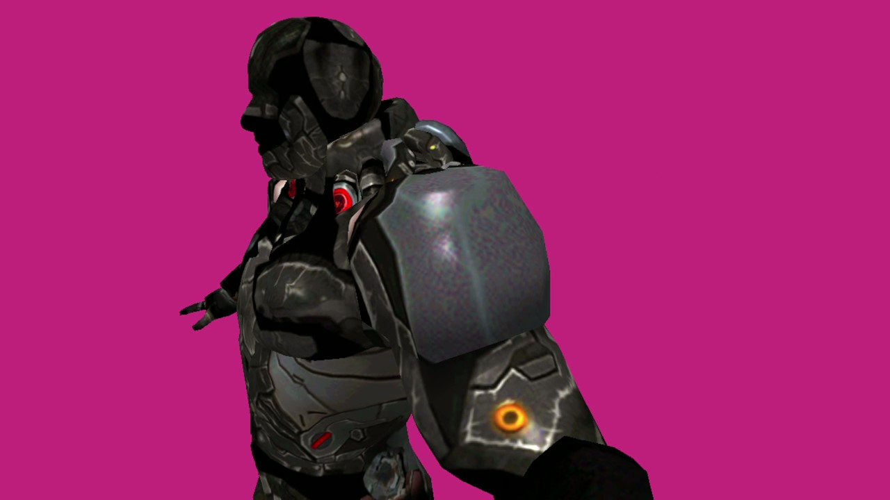

# 3DModelRenderer

Disclaimer: This is not very recent project and I've learned a lot since making it. I decided to leave it here because it shows my experience with UE5 and ability to create fun gameplay. For quality, clean code go [here](https://github.com/antoniwidelski/TerrainGeneration).

This project is 3D model renderer made with OpenGL.

